# Aperçu de MissionOps — état au 2 octobre 2026

Captures prises sur l'application de production (`next build` + `next start`),
base PostgreSQL 16 amorcée par `pnpm db:reset && pnpm db:seed:demo`
(organisation « Croix-Rouge Guinée », 9 missions sur tout le cycle de vie).

## En chiffres

| Indicateur                | Valeur                                                    |
| ------------------------- | --------------------------------------------------------- |
| Phases du plan livrées    | 1 à 9 (Phase 0 : terrain ; Phase 10 : sur demande client) |
| Écrans                    | 32 pages, 12 routes d'API                                 |
| Code applicatif           | ~23 500 lignes TypeScript                                 |
| Tests                     | 600 unitaires · 17 d'intégration · 15 parcours Playwright |
| Couverture du domaine     | 99,6 % (argent : 100 %, bloquant)                         |
| JavaScript initial (max.) | 197 Ko gzippés (écran Terrain), budget 200 Ko bloquant    |
| Vulnérabilités (prod)     | 0 (`pnpm audit --prod`)                                   |
| Langues                   | français (par défaut), anglais                            |

## Sur le téléphone de l'agent (375 px)

| Connexion                    | Tableau de bord                    | Terrain hors ligne         |
| ---------------------------- | ---------------------------------- | -------------------------- |
| 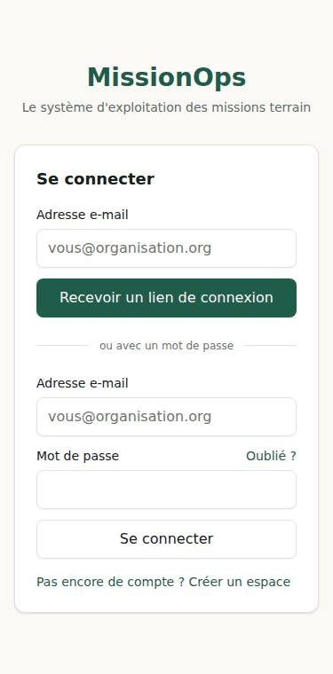 | 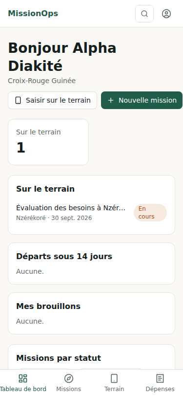 | 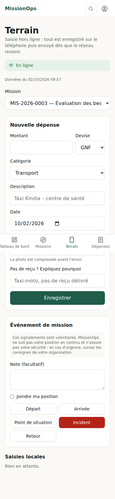 |

| Nouvelle demande                    | Destination en deux touches, sans réseau  |
| ----------------------------------- | ----------------------------------------- |
| 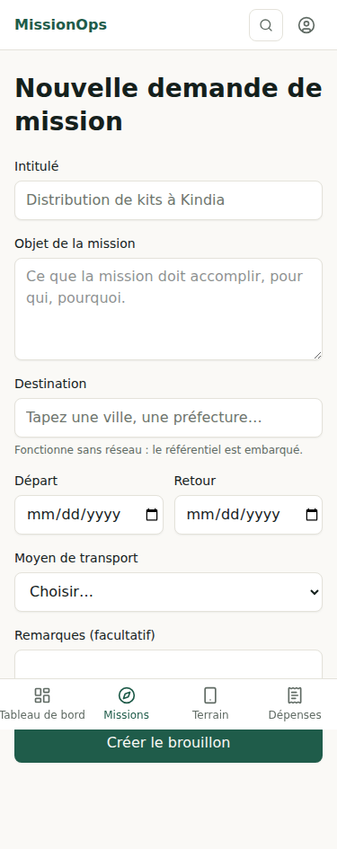 | 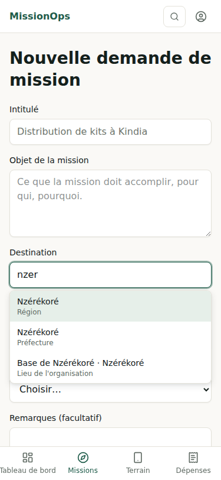 |

## Au bureau (1440 px)

**Tableau de bord de la finance** — files d'attente et indicateurs du mois.

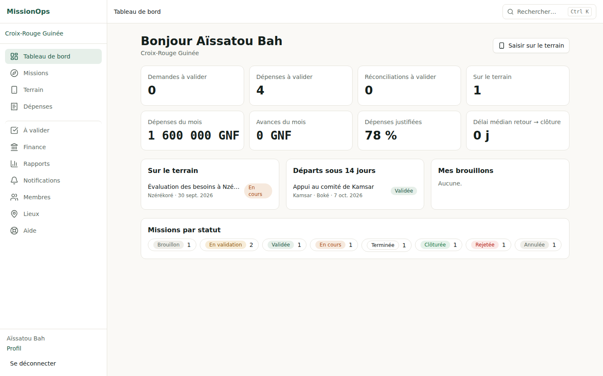

**Missions** — filtres par statut, recherche insensible aux accents.

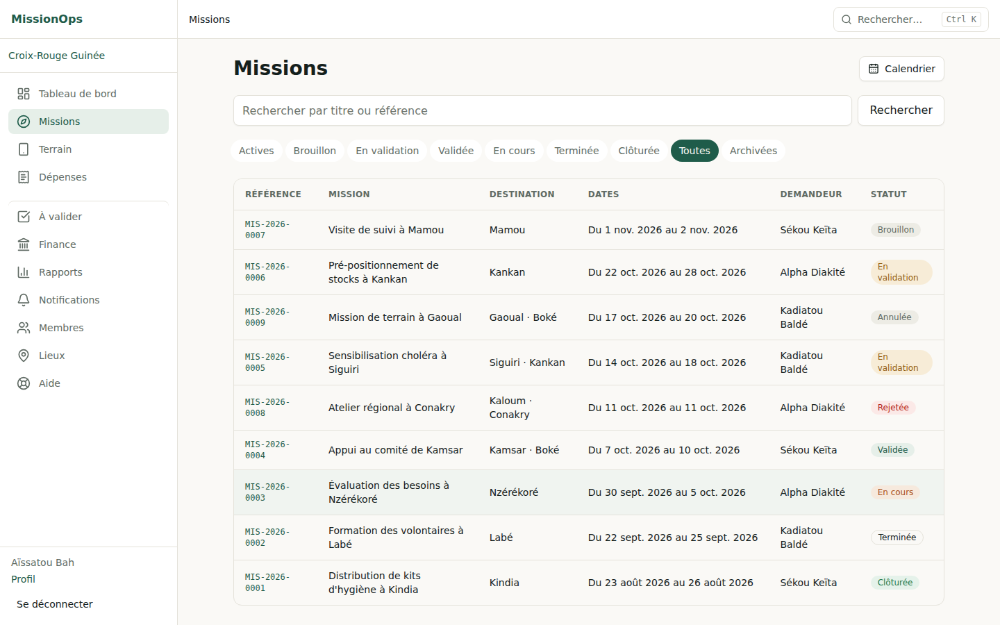

**Fiche mission** — bande de mission, circuit de validation, budget, avances,
suivi budgétaire, dépenses, journal terrain, documents, historique.

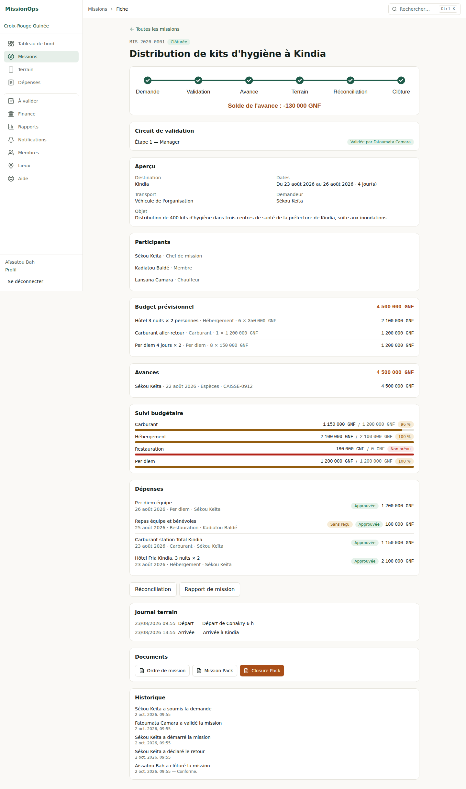

**Réconciliation de l'avance** — solde, sens du règlement, écarts justifiés.

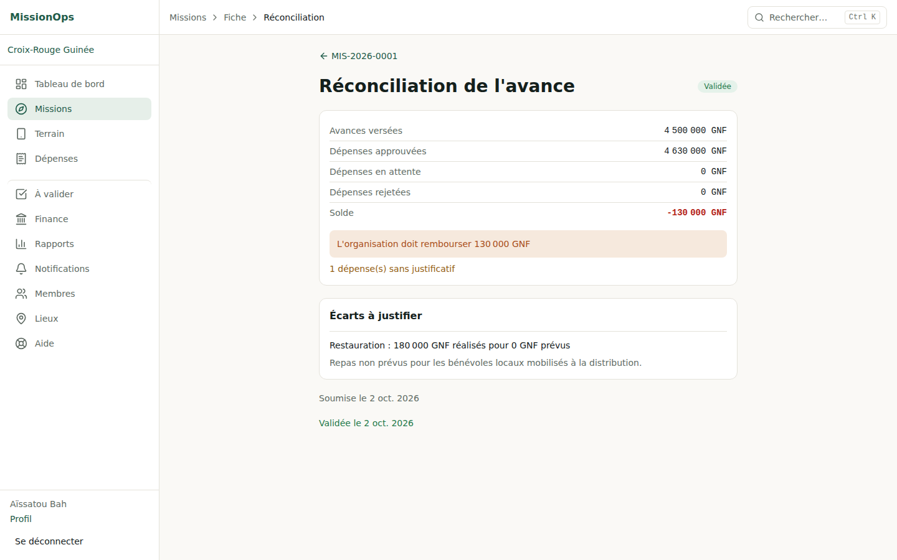

| Calendrier                    | À valider (dont validation par lot) |
| ----------------------------- | ----------------------------------- |
| 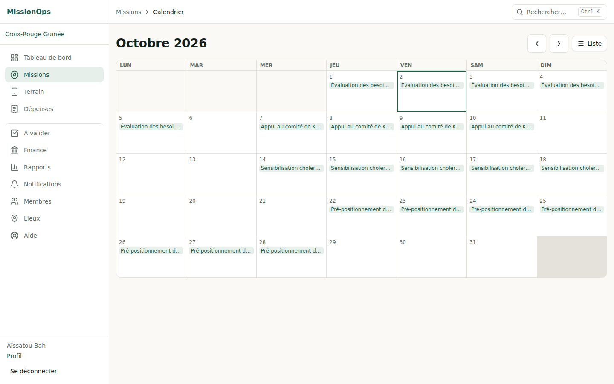 | 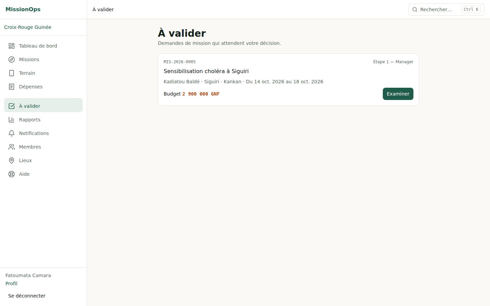        |

**Rapports de coûts** — par catégorie, mois, destination et mission ; export
comptable CSV.

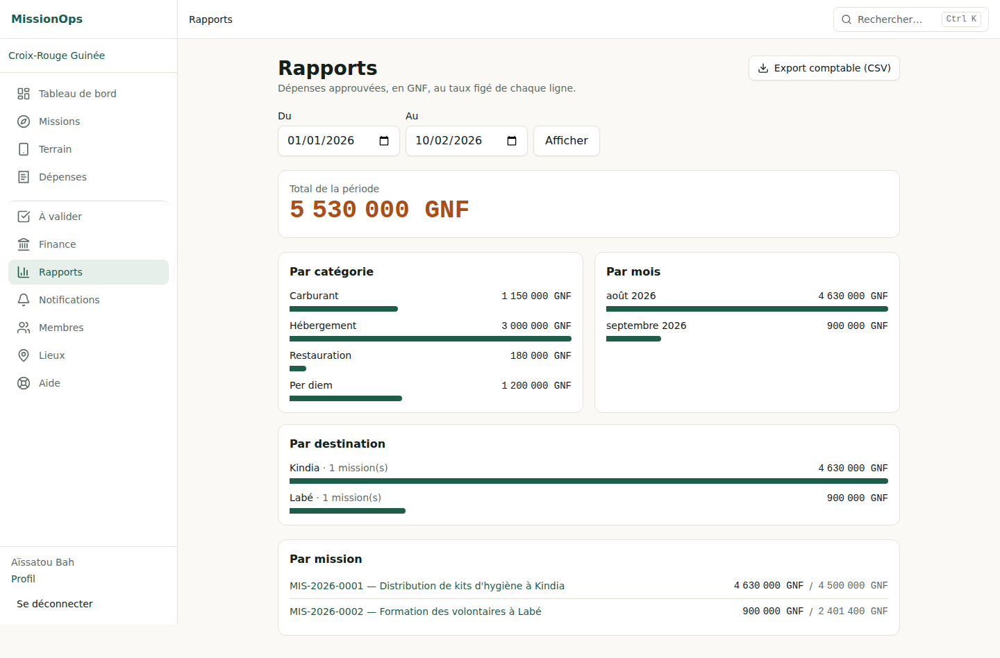

| Dépenses et validation financière | Journal d'audit (Directeur pays) |
| --------------------------------- | -------------------------------- |
| 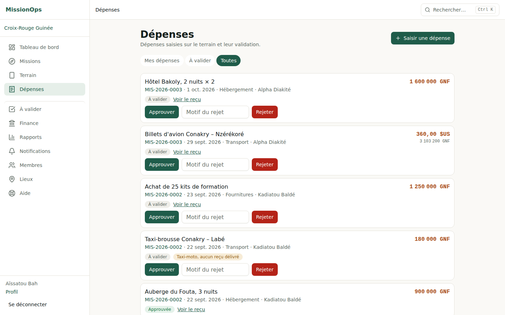       | 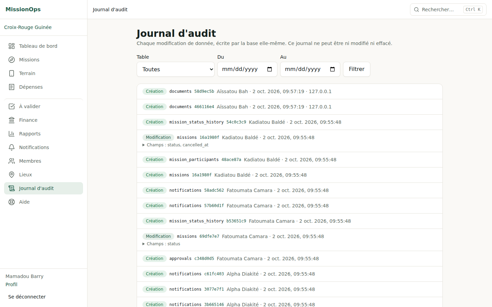 |

## Documents générés

| Ordre de mission                 | Closure Pack — page 1        | Closure Pack — page 2        |
| -------------------------------- | ---------------------------- | ---------------------------- |
| 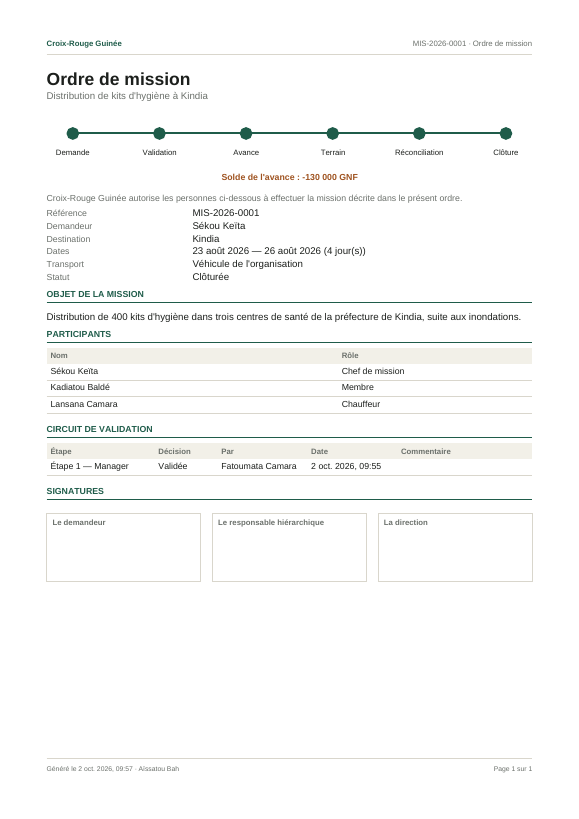 | 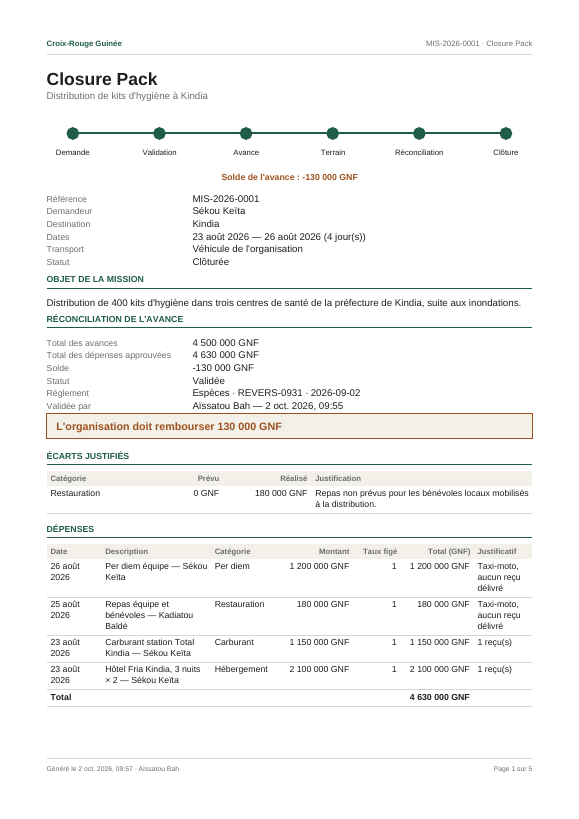 | 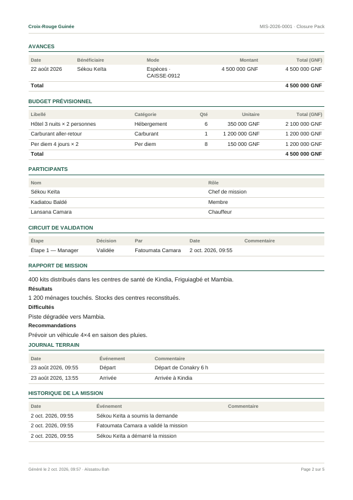 |

Fichiers complets : [ordre-de-mission.pdf](ordre-de-mission.pdf),
[closure-pack.pdf](closure-pack.pdf) (5 pages : réconciliation, dépenses à taux
figés, écarts, avances, budget, validation, rapport, journal terrain,
historique, empreintes SHA-256 et annexe des justificatifs).

## Ce qui reste hors du code

- Mise en ligne de `staging` (secrets Fly, Postgres managé UE, volume `/data`,
  `APP_URL` et `CRON_SECRET`).
- Comptes des fournisseurs : Resend (SPF/DKIM), WhatsApp Business, Sentry.
- Avec le pilote : trajet Conakry–Kindia, téléphone réel en 3G, lecteur
  d'écran, exercice de restauration.
- Vérification du référentiel géographique contre COD-AB ; relecture juridique
  des documents de conformité.
